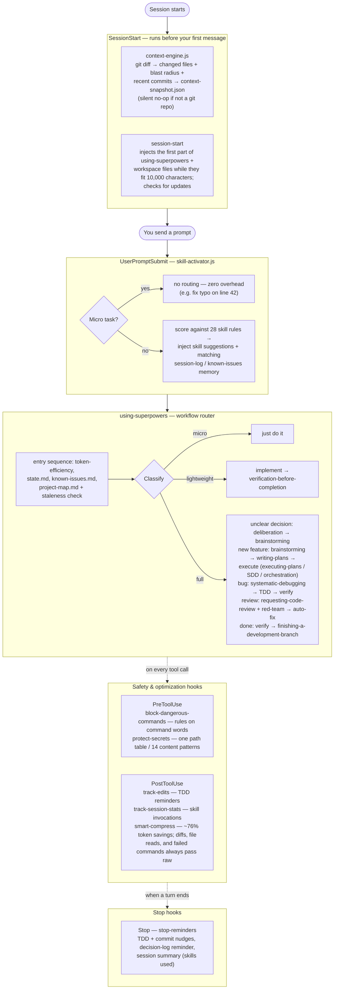

<div align="center">

[]()

[](https://github.com/brunob54/superpowers-orchestrator/stargazers)
[](RELEASE-NOTES.md)
[](LICENSE)
[](https://github.com/brunob54/superpowers-orchestrator#installation)

</div>

# Superpowers Orchestrator

**Superpowers** is a plugin for coding agents (Claude Code and GitHub Copilot CLI, which are the two it has been used with — Copilot CLI only up to v7.13.0, so later releases are untested there; Cursor and OpenCode integrations exist but are untested, and Codex is no longer supported — see [Platform status](#installation)) that adds a disciplined development workflow: a design specification first, then a task plan, then test-driven implementation with staged code reviews. The workflow is implemented as *skills* (instruction files the agent follows) and *hooks* (scripts that run automatically at session events).

This repository is a fork of [obra/superpowers](https://github.com/obra/superpowers) via [REPOZY/superpowers-optimized](https://github.com/REPOZY/superpowers-optimized). Its own contribution is **orchestration**: the same workflow can run autonomously from an approved specification to a merge-ready branch, with independent review rounds between stages — see [What this repo adds](#what-this-repo-adds).

> [!TIP]
> **New to the plugin?** Start with the [User Guide](docs/guide/README.md) — the day-to-day operating manual: workflows, trigger phrases, autonomous runs, and recovery.

> [!NOTE]
> **Lineage & status:** this repository builds on two origins — the original [obra/superpowers](https://github.com/obra/superpowers) by Jesse Vincent and its optimized fork [REPOZY/superpowers-optimized](https://github.com/REPOZY/superpowers-optimized) (baseline v6.6.1). Full credit to both. The project was named *superpowers-optimized* through v6.15.1 and was renamed to **superpowers-orchestrator** at v7.0.0, to match its main feature: the autonomous orchestration pipeline. This fork's own additions (v6.7.0–v7.68.0) are **under testing and evaluation** — see [What this repo adds](#what-this-repo-adds).
>
> **How this fork is built:** every release of this fork (v6.7.0–v7.68.0) was designed, implemented, and reviewed end-to-end by Claude models running in Claude Code — with the plugin itself driving its own development. Up to v7.63.0, the `Co-Authored-By` lines of the fork's commits name Claude Opus 5 (410 commits, 2026-07-27 to 2026-09-23), Claude Fable 5.1 (283, from 2026-09-02), Claude Fable 5 (108, 2026-07-07 to 2026-08-31), Claude Opus 5.5 (63, from 2026-09-23), Claude Sonnet 5 (59) and Claude Sonnet 5.5 (21). Such a line names the model that made a commit, not the role it had: batched implementation dispatches task subagents on smaller Claude models where the plugin's model-selection rules call for it. The fork bootstraps on its own releases: v6.7.0 was built under the parent fork plugin (baseline v6.6.1), and each release since was built with the fork's *previous* release installed. Every workflow described below was used, under real conditions, to build the version you're reading about.

## What this repo adds

The skills and workflow modes that this fork adds to the REPOZY v6.6.1 baseline. [docs/FORK-IMPROVEMENTS.md](docs/FORK-IMPROVEMENTS.md) explains the first five with usage and motivation; [RELEASE-NOTES.md](RELEASE-NOTES.md) has the details of every release:

- **SDD Batched Autonomous Mode (v6.7.0)** — runs a plan in resumable batches of N tasks with a `state.md` handoff: "implement the next 3 tasks", then after `/clear`, "resume the plan". [Details](docs/FORK-IMPROVEMENTS.md#1-sdd-batched-autonomous-mode-v670)
- **SDD Token-Optimized Review Flow (v6.8.0)** — one task reviewer with two verdicts and file-based handoffs, ported from upstream obra v6.0.0; subagent-driven-development uses it automatically. [Details](docs/FORK-IMPROVEMENTS.md#2-sdd-token-optimized-review-flow-v680)
- **multi-doc-review (v6.9.0)** — N independent review rounds with rotating lenses on a spec or a plan, M reviewers per round: `/multi-doc-review <doc-path> [N|N=<n>] [M=<m>]`. [Details](docs/FORK-IMPROVEMENTS.md#3-multi-doc-review--n-round-independent-document-review-v690)
- **multi-code-review (v6.10.0)** — N independent whole-branch code review rounds with rotating lenses and fixes between rounds: `/multi-code-review [BASE] [N|N=<n>] [M=<m>]`. [Details](docs/FORK-IMPROVEMENTS.md#4-multi-code-review--n-round-independent-whole-branch-code-review-v6100)
- **orchestrating-development (v6.14.0)** — from an approved spec, runs plan writing, plan reviews, batched implementation and code reviews without stopping, and ends before merge: "orchestrate development of <spec path>". [Details](docs/FORK-IMPROVEMENTS.md#5-orchestrating-development--autonomous-spec-to-merge-gate-pipeline-v6140)
- **researching-prior-art (v7.2.0)** — when a design adds or changes a dependency, relies on version-specific API behaviour or picks a hosted service, read-only research subagents collect verified evidence into one report under `docs/research/`. [Details](RELEASE-NOTES.md#v720--prior-art-research-grounds-technology-decisions)
- **handoff (v7.20.0)** — `/handoff [slug]` writes a continuation prompt for a fresh session into `tmp/docs/<date>-handoff-<slug>.md`. [Details](RELEASE-NOTES.md#v7200--a-handoff-skill-writes-the-prompt-for-a-fresh-session)
- **pickup (v7.23.0)** — `/pickup [handoff path]` resumes the newest or a named handoff, or an orchestration run that stopped before its end. [Details](RELEASE-NOTES.md#v7230--a-pickup-skill-resumes-a-handoff-or-an-unfinished-orchestrator-run)
- **worklog (v7.52.0)** — `/worklog [new|update|close] [<slug>]` keeps one tracking document per piece of multi-part work, at `docs/worklogs/<slug>.md`. [Details](RELEASE-NOTES.md#v7520--the-worklog-skill-one-tracking-document-per-piece-of-multi-part-work)
- **dashboard (v7.56.0)** — `/superpowers-orchestrator:dashboard refresh` publishes the repository's status (unfinished runs, branches, work logs, open items, releases) on a private claude.ai Artifact page; `sync` copies the edits you approve from the page back into the Markdown files. [Details](RELEASE-NOTES.md#v7560--the-dashboard-skill-the-repositorys-status-on-a-claudeai-page)

## Inherited from the parent projects

From [REPOZY/superpowers-optimized](https://github.com/REPOZY/superpowers-optimized) (baseline v6.6.1):

- Automatic 3-tier workflow routing (micro / lightweight / full), so overhead stays proportional to task size
- The 9 lifecycle hooks: dangerous-command blocking, secret protection, Bash output compression, skill activation, edit tracking, session statistics, stop reminders (platform-specific subsets on Codex/OpenCode — see the parity note below)
- Security review (OWASP checklist) inside code review, and the red-team agent with its auto-fix pipeline
- The cross-session memory stack: `project-map.md`, `session-log.md`, `state.md`, `known-issues.md`, plus the automatic `context-snapshot.json` written at every session start
- Token-efficiency rules: concise responses, parallel tool calls, exploration tracking

From [obra/superpowers](https://github.com/obra/superpowers) (the original, by Jesse Vincent): the skills framework itself and the core workflow skills — brainstorming, writing plans, test-driven development, systematic debugging, and code review.

## Quick start
In Claude Code or Copilot CLI, start a new chat and paste:

```
Activate Superpowers Orchestrator and plan a secure user-authentication endpoint with full TDD and security review.
```

The agent will automatically route to the correct workflow, apply safety guards, and run an integrated security review during code review — no manual skill selection required.

See [Installation](#installation) for install, update, and uninstall commands on all platforms.

> [!NOTE]
> **Codex parity boundary (Codex is no longer supported):** Claude Code gets the full 9-hook lifecycle. Codex adapters are implemented for `SessionStart`, `UserPromptSubmit`, and `PreToolUse(Bash)` on macOS/Linux, and expect `codex_hooks = true` with `codex-cli 0.118.0+`. This was written from the Codex documentation and has not been run against a live Codex install, so treat it as unverified. This repo now also ships a Codex-specific `PostToolUse(Bash)` smart-compress hook that can replace noisy Bash output after execution using the existing compression rules. `Stop` is implemented for Codex, but its reminder has never been seen surfacing in a live session. Codex still does **not** expose Claude's `PostToolUse(Edit|Write|Skill)`, `SubagentStop`, or `Read/Edit/Write` interception, so full Claude parity is not possible today. (Since v7.59.0 the Claude Code hook also replaces Bash output after execution; it no longer rewrites the command before execution.)

---

> [!IMPORTANT]
> **Compatibility note:** this plugin ships a workflow router and 32 skills covering debugging, planning, code review, TDD, and execution.
>
> Other plugins or custom skills/agents in your `.claude/skills/` and `.claude/agents/` folders can interfere when they cover the same domains: duplicate skills cause trigger conflicts and contradictory instructions, and every extra skill adds text to the model's context. If you see conflicting behavior, disable the overlapping plugins or skill files.


---

A typical session runs like this. For a non-trivial task, the agent does not start coding immediately: it first asks questions, one section at a time, until a clear specification exists and you approve it.

From the approved design, the agent writes an implementation plan whose tasks follow red/green TDD cycles (write a failing test, make it pass) and stay minimal — no speculative features, no duplicated code.

When you confirm, the plugin routes execution to *subagent-driven-development* or *executing-plans* and runs staged reviews: specification compliance first, then code quality, with security analysis (OWASP checklist) on sensitive changes. For complex logic, the *red-team* agent attacks the code with concrete failure scenarios; each critical finding becomes a failing test, a fix, and a regression check.

**The agent evaluates relevant skills before every task.** The workflows are mandatory, not suggestions, and overhead stays proportional to task complexity:
- **Micro-tasks** bypass all gates entirely
- **Lightweight tasks** receive a single verification checkpoint
- **Full-complexity tasks** engage the complete pipeline

---

## How It Works



## Research-Informed Design

The design decisions in this fork are informed by three research papers on LLM agent behavior. These papers motivated the approach:

### Minimal context files outperform verbose ones

**Paper:** [Evaluating AGENTS.md: Are Repository-Level Context Files Helpful for Coding Agents?](https://arxiv.org/abs/2602.11988) (AGENTbench, 138 tasks, 12 repos, 4 agents)

Key findings that shaped this fork:
- **LLM-generated context files decreased success rates by ~2-3%** while increasing inference costs by over 20%. More instructions made tasks *harder*, not easier.
- **Developer-written context files only helped ~4%** — and only when kept minimal. Detailed directory enumerations and comprehensive overviews didn't help agents find relevant files faster.
- **Agents used 14-22% more reasoning tokens** when given longer context files, suggesting cognitive overload rather than helpful guidance.
- **Agents followed instructions compliantly** (using mentioned tools 1.6-2.5x more often) but this compliance didn't translate to better outcomes.

**What we changed:** Every skill was rewritten as a concise operational checklist instead of verbose prose. The `CLAUDE.md` contains only minimal requirements (specific tooling, critical constraints, conventions). The 3-tier complexity classification (micro/lightweight/full) skips unnecessary skill loading for simple tasks. The result is lower prompt overhead in every session and fewer failures from instruction overload.

### Prior assistant responses can degrade performance

**Paper:** [Do LLMs Benefit from Their Own Words?](https://arxiv.org/abs/2602.24287) (4 models, real-world multi-turn conversations)

Key findings that shaped this fork:
- **Removing prior assistant responses often maintained comparable quality** while reducing context by 5-10x. Models over-condition on their own previous outputs.
- **Context pollution is real:** models propagate errors across turns — incorrect code parameters carry over, hallucinated facts persist, and stylistic artifacts constrain subsequent responses.
- **~36% of prompts in ongoing conversations are self-contained "new asks"** that perform equally well without assistant history.
- **One-sentence summaries of prior responses outperformed full context**, suggesting long reasoning chains degrade subsequent performance.

**What we changed:** The `context-management` skill actively prunes noisy history and persists only durable state across sessions. Subagent prompts request only task-local constraints and evidence rather than carrying forward full conversation history. Execution skills avoid long historical carryover unless required for correctness. The `token-efficiency` standard enforces these rules as an always-on operational baseline.

### Single reasoning chains fail on hard problems

**Paper:** [Self-Consistency Improves Chain of Thought Reasoning in Language Models](https://arxiv.org/abs/2203.11171) (Wang et al., ICLR 2023)

Key findings that shaped this fork:
- **A single chain-of-thought can be confident but wrong** — the model picks one reasoning path and commits, even when that path contains an arithmetic slip, wrong assumption, or incorrect causal direction.
- **Generating multiple independent reasoning paths and taking majority vote significantly improves accuracy** across arithmetic, commonsense, and symbolic reasoning tasks.
- **Consistency correlates with accuracy** — when paths agree, the answer is almost always correct. When they scatter, the problem is genuinely hard or ambiguous, which is itself a useful signal.
- **Diversity of reasoning matters more than quantity** — 5 genuinely different paths outperform 10 paths that all reason the same way.

**What we changed:** The `systematic-debugging` skill now applies self-consistency during root cause diagnosis (Phase 3): before committing to a hypothesis, the agent generates 3-5 independent root cause hypotheses via different reasoning approaches, takes a majority vote, and reports confidence. Low-confidence diagnoses (<= 50% agreement) trigger a hard stop — gather more evidence before touching code. The `verification-before-completion` skill applies the same technique when evaluating whether evidence actually proves the completion claim, catching the failure mode where evidence is interpreted through a single (potentially wrong) lens. The underlying technique lives in `self-consistency-reasoner` and fires only during these high-stakes reasoning moments, keeping the token cost targeted.

### Social accountability and iterative fixing improve agent accuracy

**Research:** [2389.ai research on multi-agent collaboration](https://2389.ai/products/simmer/) and their [claude-plugins repository](https://github.com/2389-research/claude-plugins)

Key findings that shaped this fork:
- **Social accountability language in agent prompts significantly improves accuracy.** Agents told that downstream work depends on their output (e.g. "the fix pipeline acts on your findings — a false positive wastes a full cycle, a missed bug ships") perform measurably better than agents given identical tasks without this framing.
- **Sequential batch fixing is fragile when findings share code.** Fixing all Critical/High findings in one pass without re-assessing between fixes can cause conflicts when multiple findings touch the same functions. An ASI (Actionable Side Information) approach — fix one finding, re-check affected files only, re-prioritize, repeat — prevents fix collisions and converges faster.
- **Deliberation before brainstorming improves architectural decisions.** When the problem itself may be mis-framed or the options aren't well-defined yet, convening named stakeholder perspectives (each speaks once, without debate) surfaces convergence and live tension without forcing a premature choice. This prevents committing to solutions before the right question has been asked.

**What we changed:** Social accountability framing was added to the `code-reviewer`, `red-team`, and `implementer` prompts. The auto-fix pipeline in `requesting-code-review` was rewritten as an ASI-guided iterative loop (fix one finding → targeted re-check of affected files only → re-assess remaining, identify new ASI → repeat). A new `deliberation` skill was added for complex architectural decisions where the problem needs reframing before brainstorming begins.

### Combined impact

These research insights drive five core principles throughout the fork:
1. **Less is more** — concise skills, minimal always-on instructions, and explicit context hygiene
2. **Fresh context beats accumulated context** — subagents get clean, task-scoped prompts instead of inheriting polluted history
3. **Compliance != competence** — agents follow instructions reliably, so the instructions themselves must be carefully engineered (rationalization tables, red flags, forbidden phrases) rather than simply comprehensive
4. **Verify your own reasoning** — multi-path self-consistency at critical decision points (diagnosis, verification) catches confident-but-wrong single-chain failures before they become expensive mistakes
5. **Accountability and iteration** — agents told that their output has real downstream consequences are more accurate; fixing findings one at a time with re-assessment between fixes prevents collisions and converges faster than batch processing


---


## Session Memory

An agent session normally starts with no memory of previous sessions: the AI re-explores structure it already mapped, re-proposes approaches that were already rejected, and re-debugs errors that were already solved. The memory stack removes that repeated work — each session starts knowing what was tried and what was decided and why. When HEAD (the current commit) is still the commit at which `context-snapshot.json` was written, the session also starts knowing what the newest commits changed.

The plugin builds this memory stack at your project root:

```
context-snapshot.json  ← git blast radius + changed files (written automatically every session)
project-map.md         ← structure + key files + critical constraints (never re-explore)
session-log.md         ← decision history + approach rejections (never re-explain)
known-issues.md        ← error→solution map (never re-debug the same thing)
state.md               ← current task snapshot (never lose mid-work progress)
```

### project-map.md — A guide to the project, written by the AI for the AI

**Why it exists.** A new session knows nothing about your project. To find the file it needs, the AI lists folders and opens files. Each file it opens costs time and uses part of the context window (the limited amount of text the model can hold during one session). `project-map.md` is a short file that describes the project: how it is organised, which files matter and what each one does, and which important facts cannot be seen in the code. You ask for the map once, by saying "map this project", and the AI writes it. After that, a hook (a script that Claude Code runs automatically at a fixed moment) adds the map to each new session. The AI can then go to the right file directly instead of exploring.

The map is an index, not a copy of the code. When the AI must change or debug a file, it still reads that file.

The map does not replace `CLAUDE.md` (the instruction file that Claude Code reads at the start of every session). `CLAUDE.md` holds instructions that you write for the AI: how to work in this project. `project-map.md` holds a description that the AI writes for itself: what exists and where.

**What it contains.** A header line records when the map was written and at which git commit. Four sections follow:

| Section | What it holds |
|---|---|
| Directory Structure | One line per top-level folder: what the folder is for |
| Key Files | 10 to 20 files that other parts depend on, or whose purpose is not clear from the name, with one line each |
| Critical Constraints | Facts that are not visible in the code and that took time to learn. This is the most valuable section |
| Hot Files | The files that past sessions changed most often |

Example — a part of the map of this plugin's own repository:

```markdown
# Project Map
_Generated: 2026-03-20 14:32 | Git: a4b9c2d_

## Directory Structure
skills/ — the skills, one folder each: skills/<name>/SKILL.md
hooks/ — the hook scripts, hooks.json, skill-rules.json

## Key Files
hooks/skill-rules.json — keywords and patterns that decide which skill is suggested for a prompt
hooks/session-start — runs when a session starts; adds the memory files to the session

## Critical Constraints
- hooks.json must use double quotes around ${CLAUDE_PLUGIN_ROOT}; single quotes break the hooks on Linux
- plugin.json and marketplace.json must always have identical version strings

## Hot Files
hooks/stop-reminders.js, hooks/skill-activator.js, skills/using-superpowers/SKILL.md
```

**How to create it.** Say "map this project". This plugin's `context-management` skill explores the project and writes `project-map.md` in the project root (the folder in which you open the session). The file must be in that folder, because the hook that reads it looks nowhere else. The skill keeps the map under 150 lines. Git does not commit the map: when git does not already track the file, the `track-edits` hook adds it to git's local exclude file (a list of files that git ignores, kept inside the `.git` folder and never committed), so `git status` does not show it.

The AI also offers a map without being asked, in two cases:
- **A build request in a folder without a map.** Your request contains a word such as "build", "create", "implement" or "write", and the folder has no `project-map.md`. Before it starts the work, the AI asks you whether to set up the memory files: it offers to run `git init` (only when the folder is not inside a git repository) and to generate the map. If you agree, it does both and then continues with your request. If you decline, it starts your request immediately.
- **Any other task in a project without a map.** The project has 10 or more files and no map, and your task is not a micro task (a typo fix, the rename of one variable, or a one-line configuration change). The AI tells you once per session that you can say "map this project". It does not stop.

**How a session uses it.** The `session-start` hook runs when a session starts, after `/clear`, and after a compaction (when Claude Code replaces a long conversation with a summary). It does not run when you resume a session with `--resume` or `--continue`. Each time it runs, it adds the map to the session (the plugin calls this "injecting"):
- A map of 200 lines or fewer is added whole. A longer map is reduced to its Critical Constraints and Hot Files sections.
- Everything the hook adds must stay under 10,000 characters (see **session-start** under Hooks below). The hook first adds the first part of the `using-superpowers` skill, and the map is the last memory file in its order. When the map does not fit in the space that is left, the hook adds only a line that names the file, and the AI reads the file itself. A map under 150 lines can still be too large: the limit counts characters, not lines.

**When the map is out of date.** The map is "stale" when the project has changed since the map was written. Each time the hook runs, it compares the commit recorded in the map's header with HEAD. When the recorded hash is not the start of HEAD's full hash, the hook adds a `<project-map-stale>` warning (so a short form of HEAD's hash counts as current, whatever its length). The hook adds this warning even when the map was too large to add. On that warning, the AI lists the files that changed since the recorded commit (`git diff --name-only <commit> HEAD`). It re-reads only those files, updates their entries, and writes the new commit into the header.

- The hook only detects a stale map; it does not update it. The AI normally makes the update when it sees the warning, because the skill instructions tell it to, but it can fail to do so. To be sure that the map is current, say "update project map".
- Without git, the hook cannot detect a stale map and gives no warning. Only when you ask the AI to update the map does it compare the modification times of the files listed under Hot Files with the time in the map's header. For this reason, when the AI generates a map in a folder without git, it offers to run `git init` first. That command creates only a `.git` folder and changes none of your files.

### context-snapshot.json — What changed right before this session

Written automatically by the `context-engine` hook on every session start. No setup, no action required. The hook runs in the background and finishes a moment after the session starts (measured: 0.2 seconds on a small repository, 7 to 8 seconds on this one), so the file that the `session-start` hook reads at a session start is the one written at an earlier session start.

```json
{
  "generated_at": "2026-03-23T21:40:12.118Z",
  "git_hash": "9636c5c8b20282c1c90f0246a1621e982358b5d6",
  "changed_files": ["hooks/context-engine.js", "hooks/hooks.json"],
  "change_stat": " 2 files changed, 140 insertions(+)",
  "recent_commits": ["9636c5c Check context-snapshot.json in Phase 1", "..."],
  "blast_radius": {
    "hooks/context-engine.js": ["hooks/hooks.json", "docs/plans/..."],
    "hooks/hooks.json": []
  },
  "cross_session_files": ["hooks/context-engine.js", "hooks/hooks.json"],
  "cross_session_commit_count": 2
}
```

Skills that need to know what changed — code review, systematic debugging — read this file first instead of running `git diff` and `git log` themselves. If the snapshot is fresh (git hash matches HEAD), the review scope is pre-verified before the agent starts. If it's stale or absent, skills fall back to git commands directly.

Automatically excluded from `git status` through the repository's local exclude file (`git rev-parse --git-path info/exclude`), which git never commits — it's a tooling artifact, not project code. No tracked file such as `.gitignore` is edited. Since v7.59.0 the hook writes the snapshot only when the path `context-snapshot.json` in the session folder is absent or is a regular file. When a symbolic link (a file that points to another file) or a folder has that name, the hook writes no snapshot and adds no exclude entry: a write through a link would overwrite the file that the link points to, and an exclude entry for a folder would hide the files in it.

The four Markdown files of the stack get the same kind of exclude entry from the `track-edits` hook, but only in two folders (since v7.59.0): the top folder of the file's git work tree (the folder that holds the checked-out files), and the session's project folder (the folder named by the environment variable `CLAUDE_PROJECT_DIR`, which Claude Code sets). A file with one of the four names in any other folder, for example `docs/known-issues.md`, is treated as a document of your project: it gets no entry and `git status` shows it. The hook writes the entry after the Edit tool or the Write tool changes the file. After a Bash command it writes an entry for one file only: a `session-log.md` that the command redirects output into (`>` or `>>`, as the save command of `context-management` does with `cat >> session-log.md`). A Bash command that only names one of the four files (`grep`, `cat`, a commit message, the body of a here-document) writes no entry, so a document of your project with such a name stays in `git status`. The hook does not see a redirect whose path holds a shell variable, nor a redirect on a line after the first `<<` of the command; the file then stays visible until the next save.

### session-log.md — What happened

An optional, manually-maintained record of decisions, rejected approaches, and key facts. Write an entry when something is worth preserving — an architectural choice, a constraint discovered the hard way, an approach that was tried and failed. Skip it when there's nothing durable to record.

| Written by | Contains |
|---|---|
| You, via `context-management` | Goal, decisions, rejected approaches, key facts |

```markdown
## 2026-03-15 10:04 [saved]
Goal: Add cross-session memory to the plugin
Decisions:
- project-map.md injected by the session-start hook directly when it fits the output budget — not dependent on Claude following instructions
- session-log.md is manual-only; auto-entries were low-signal noise, all derivable from git log
Approaches rejected: Auto-appending a [auto] entry on every Stop event — produced 30 near-identical entries per session with no decisions or reasoning, just file lists
Key facts: hooks.json requires \" not ' around ${CLAUDE_PLUGIN_ROOT} — single quotes break variable expansion on Linux
Open: Monitor whether [saved] entries get used in practice; if not, consider folding key facts into project-map.md Critical Constraints instead
```

Write an entry by invoking `context-management`. Only the most recent entries are injected at session start, and only while they fit the session-start hook's 10,000-character output budget — older entries are lookup-only, surfaced via keyword grep when a task touches the same area; entries that an archive moved to `session-log-archive.md` are not surfaced. **Entry size directly affects your per-session token cost** — the stop-hook monitors this and warns when entries exceed budget. Keep entries under 115 words.

### known-issues.md — Error memory

Maintained by the `error-recovery` skill. When a bug is solved, invoke `error-recovery` to record the error signature and fix. Before any debugging session, the AI checks `known-issues.md` first — if the error is already mapped, it applies the solution without re-investigating.

```markdown
## Cannot read properties of undefined (reading 'name')
**Error:** TypeError at hooks/skill-activator.js:47
**Root cause:** hooks.json loaded before plugin root env var was set
**Fix:** Ensure ${CLAUDE_PLUGIN_ROOT} is resolved before hook execution; use run-hook.cmd wrapper
**Context:** Windows-only; Linux resolves the var earlier in the process
```

The file grows over time into a project-specific lookup table. The more errors it captures, the less time gets spent re-diagnosing problems that were already solved.

### state.md — Mid-work snapshot

Written by `context-management` when ending a session mid-task. Read at the start of the next session before any work begins. Captures the current goal, active decisions, plan status, evidence, and open questions — so "pick up where we left off" actually works.

```markdown
# State
Current Goal: Add state.md support to context-management skill
Decisions:
- Write at project root alongside project-map.md
- Keep under 100 lines — if longer, not compressed enough
Plan Status:
- [x] Design approved
- [ ] SKILL.md updated
- [ ] README updated
Open: Whether to auto-clear state.md on session start or leave for manual cleanup
```

Unlike `session-log.md`, `state.md` is ephemeral — it represents the current task only and gets overwritten each time you save state. Once a task is complete, it can be discarded.

### The combined impact

Without this stack, every new session starts with no memory of the project:
- The AI re-globs the project to understand its structure
- Re-reads files it already understood last session
- Proposes approaches that were already rejected
- Re-debugs errors that were already solved
- Loses the "why" behind every architectural decision
- Runs git commands to discover what changed — every time, from scratch (with this stack the AI still runs them when HEAD has moved since `context-snapshot.json` was written, because the snapshot is then not injected)

With this stack, sessions start with full context and zero re-discovery overhead. The AI greets your task with: *"I see the last session on this topic (2026-03-15) established that single quotes break Linux CI — already writing the new hook with escaped double quotes. The context snapshot shows hooks/context-engine.js changed in the last commit, and hooks/hooks.json references it — scoping the review there first."*

---


## Skills Library (32 skills)

### Core Workflow
- **using-superpowers** — Mandatory workflow router with 3-tier complexity classification (micro/lightweight/full) and instruction priority hierarchy
- **token-efficiency** — Always-on: concise responses, parallel tool batching, exploration tracking, no redundant work
- **context-management** — Four-file memory stack: `project-map.md` (structure + key files + critical constraints, git-hash staleness detection), `session-log.md` (decision history, manually written via `context-management` — [saved] entries only), `state.md` (ephemeral current-task snapshot), `known-issues.md` (error→solution map)

- **handoff** — `/handoff [slug]`: writes a continuation prompt for a fresh session into `tmp/docs/<date>-handoff-<slug>.md` (what is already known, how to proceed, the conventions that cost time), saves state through `context-management`, and prints the prompt to copy; manual invocation only
- **pickup** — `/pickup [handoff path]`: resumes work in a fresh session from the newest or a named handoff, after a scan lists the commits and uncommitted changes made since the handoff was written (FRESH, CHECK or UNKNOWN), or from an unfinished orchestration run on a local feature branch, which it offers only after asking, with the bare `Resume orchestration for <path>` line; manual invocation only
- **worklog** — `/worklog [new|update|close] [<slug>]`: creates, fully updates and closes a work log, one Markdown document per piece of multi-part work at `docs/worklogs/<slug>.md` (parts, open items, accepted limits, decisions) that carries its own update rules; the session-start hook names the active work logs; never commits
- **dashboard** — `/superpowers-orchestrator:dashboard refresh | sync | share | share off | local`: publishes the repository's status (unfinished runs, branches, work logs, open items, releases, commits) as a claude.ai Artifact page, copies the owner's page edits back into the Markdown files after approval, shares a second page with pushed content only, or writes a local read-only file; never commits
- **premise-check** — Validates whether proposed work should exist before investing in it; triggers reassessment when new evidence changes the original motivation

### Design & Planning
- **deliberation** — Structured decision analysis for complex architectural choices: assembles 3–5 named stakeholder perspectives, each speaks once without debate, then surfaces convergence points and live tensions without forcing a premature conclusion. Use before brainstorming when the problem itself may need reframing
- **researching-prior-art** — Prior-art research gate for technology decisions: read-only researcher subagents gather verified external evidence (versions anchored to the repo's own manifest, registry existence and health, prior art) into one merged report before design approaches are compared
- **brainstorming** — Socratic design refinement with engineering rigor, project-level scope decomposition, and architecture guidance for existing codebases
- **writing-plans** — Executable implementation plans with exact paths, verification commands, TDD ordering, and pre-execution plan review gate
- **claude-md-creator** — Create lean, high-signal CLAUDE/AGENTS context files for repositories

### Execution
- **executing-plans** — Batch execution with verification checkpoints and engineering rigor for complex tasks
- **subagent-driven-development** — Parallel subagent execution with two-stage review gates (spec compliance, then code quality), blocked-task escalation, E2E process hygiene, context isolation, and skill leakage prevention
- **orchestrating-development** — autonomous spec→plan→review→implement→review pipeline; fresh controller subagent per phase/batch; stops only on major errors, ends before merge/PR
- **dispatching-parallel-agents** — Concurrent subagent workflows for independent tasks
- **using-git-worktrees** — Isolated workspace creation on feature branches

### Quality & Testing
- **test-driven-development** — RED-GREEN-REFACTOR cycle with rationalization tables, testing anti-patterns, and advanced test strategy (integration, E2E, property-based, performance)
- **systematic-debugging** — 5-phase root cause process: known-issues check, investigation (reads `context-snapshot.json` first to answer "what changed recently?", when the file's `git_hash` is the present HEAD), pattern comparison, self-consistency hypothesis testing, fix-and-verify
- **verification-before-completion** — Evidence gate for completion claims with multi-path verification reasoning and configuration change verification
- **self-consistency-reasoner** — Internal multi-path reasoning technique (Wang et al., ICLR 2023) embedded in debugging and verification

### Code Health
- **refactoring** — Behavior-locked structural changes: characterization tests before any move, one change at a time with tests green after each, per-category stale reference audit at completion
- **performance-investigation** — Measure-first performance work: quantitative baseline, profiling to find the real bottleneck, hypothesis with predicted improvement, re-measurement after each fix
- **dependency-management** — Incremental dependency updates with verification: audit, impact assessment, one-at-a-time upgrades, lockfile merge conflict resolution, security vulnerability fast-path

### Review & Integration
- **requesting-code-review** — Structured code review with integrated security analysis (OWASP, auth flows, secrets handling, dependency vulnerabilities), adversarial red team dispatch, and ASI-guided iterative auto-fix pipeline for critical findings (fix one → re-check affected files only → re-prioritize → repeat)
- **receiving-code-review** — Technical feedback handling with pushback rules and no-sycophancy enforcement
- **multi-doc-review** — N-round independent spec/plan review: M clean-context reviewers per round (default 1) under rotating lenses, reports consolidated per round, findings merged between rounds, sidecar audit log; automatic at the brainstorming/writing-plans gates or direct via `/multi-doc-review <doc> [N|N=<n>] [M=<m>]`
- **multi-code-review** — N-round independent whole-branch code review: M clean-context reviewers per round (default 1) under rotating lenses, reports consolidated per round, one fix subagent per round, sidecar audit log; automatic at subagent-driven-development's final review gate or direct via `/multi-code-review [BASE] [N|N=<n>] [M=<m>]`
- **finishing-a-development-branch** — 4-option branch completion (merge/PR/keep/discard) with safety gates

### Intelligence
- **error-recovery** — Maintains project-specific `known-issues.md` mapping recurring errors to solutions, consulted before debugging
- **frontend-design** — Design intelligence system with industry-aware style selection, 25 UI styles, 30 product-category mappings, page structure patterns, UI state management, and 10 priority quality standards (accessibility, touch, performance, animation, forms, navigation, charts)

### Environment variables

Set these in `settings.json`'s `env` block so they survive plugin updates; a changed value takes effect after the CLI is restarted.

Three of them travel into the session as one `<superpowers-defaults>` block that `hooks/session-start` appends after every embedded workspace file, carrying one `name=value` line per parameter. Skills are Markdown read by the model and cannot read environment variables, so this block is how a value reaches a skill. An invalid or unset value falls back silently to the default below, and the line is emitted anyway — a block planted in a repository file can never be the last complete block of the `hooks/session-start` injection, and a block that reaches a session through a file that was read is ignored whatever its position.

- `SUPERPOWERS_REVIEWERS_PER_LENS` — M, reviewers per lens: how many identical reviewer subagents each `multi-doc-review` / `multi-code-review` round dispatches in parallel. Range: an integer 1–5. Default: 1. Override: an `M=<m>` stated in an invocation, answered in orchestration's Phase 0, or answered at one of the three review gates (spec review, plan review, whole-branch code review) wins over it. Honored on Claude Code; not verified on Cursor; no block is emitted on Codex or OpenCode, so the default applies there unless you state a value in the invocation. Example: `{ "env": { "SUPERPOWERS_REVIEWERS_PER_LENS": "3" } }`.
- `SUPERPOWERS_REVIEW_ROUNDS` — N, the number of review rounds each review loop runs. Range: an integer 1–10. Default: 3. `0` is deliberately not accepted: it would silently disable spec review, the plan's rotating review rounds and whole-branch code review on every future session (a plan still gets its Execution readiness pass). N = 0 stays available where you state it and see its effect — in an invocation, and as an option at every gate question. Override: an `N=<n>` stated in an invocation, answered in orchestration's Phase 0, or answered at one of the three review gates wins over it. Honored on Claude Code; not verified on Cursor; no block is emitted on Codex or OpenCode, so the default applies there unless you state a value in the invocation. Example: `{ "env": { "SUPERPOWERS_REVIEW_ROUNDS": "5" } }`.
- `SUPERPOWERS_BATCH_TASK_CAP` — how many tasks one `subagent-driven-development` Batched Autonomous Mode batch implements before it stops and writes its handoff. Range: an integer 1–5. Default: 3. Override: a task count you state when starting the batch run ("implement the next 8 tasks"), or the cap answered in orchestration's Phase 0, wins over it; a stated count is not clamped to 5. Honored on Claude Code; not verified on Cursor; no block is emitted on Codex or OpenCode, so the default applies there unless you state a value in the invocation. Example: `{ "env": { "SUPERPOWERS_BATCH_TASK_CAP": "2" } }`.

The remaining three are read by hook code directly and never reach a skill.

- `SUPERPOWERS_AUTO_UPDATE` — `0` disables the startup update check; see **Available Update Notification** below. Range: `0` or unset. Default: unset (the check runs). Override: not overridable in an invocation. Honored wherever the `session-start` hook runs.
- `SP_NO_COMPRESS` — `1` disables smart-compress globally, so Bash output enters the context unfiltered; a `.sp-no-compress` file disables it per project. Range: `1` or unset. Default: unset (compression is on). Override: not overridable in an invocation. Honored wherever the `bash-compress-hook` runs. See the **bash-compress-hook** entry below and `docs/architecture/smart-compress.md`. *(The `SP_` prefix breaks the `SUPERPOWERS_` convention and is kept: the name is already documented and users may have it in `settings.json`.)*
- `SUPERPOWERS_STOP_REMINDERS_OFF` — a comma-separated list of stop reminders to switch off; see **stop-reminders** below. Names: `tdd`, `commit`, `decision-log`, `state-md`, `session-log-size`. Names are not case-sensitive. An unknown name (for example a list separated by spaces instead of commas) switches nothing off; the next block of the hook names it and lists the known names. The hook never blocks only to show this warning, because Claude Code shows no other text from a Stop hook. A reminder that is switched off never blocks a stop. Use it when a project rule conflicts with a reminder, for example a rule that the assistant may commit only after the user approves: `commit` removes the commit reminder. Range: a list of those names, or unset. Default: unset (every reminder is on). Override: not overridable in an invocation. Honored wherever the `stop-reminders` hook runs (Claude Code). Example: `{ "env": { "SUPERPOWERS_STOP_REMINDERS_OFF": "commit" } }`.

### Hooks (9 total)
This is the full cross-platform hook inventory for the plugin. Claude Code gets the full set. Codex ships adapters for the smaller `SessionStart` / `UserPromptSubmit` / `PreToolUse(Bash)` / `PostToolUse(Bash)` / `Stop` subset in `hooks/codex/*`, subject to Codex platform limits. These have not been confirmed live.

- **context-engine** (SessionStart) — Runs git commands on every session start and writes `context-snapshot.json`: changed files, blast radius (which other files reference each changed file, filtered to actual import/require references), recent commits, and change stats. Uses per-project watermarks (md5 of cwd) so multiple projects don't interfere, and cross-session diff base so "what changed" reflects changes since your last session, not just the last commit. Zero dependencies. Silent no-op on non-git projects. Since v7.59.0 the hook starts git with an argument list and no shell, so the text of a file name is never run as a command, and it writes the snapshot only when the path `context-snapshot.json` is absent or is a regular file (not a symbolic link, not a folder)
- **session-start** (SessionStart) — Injects the first part of the using-superpowers skill into every session (the part above the marker line in its SKILL.md; the Skill tool loads the rest); injects the workspace files of the project folder (the folder in `CLAUDE_PROJECT_DIR`, also after a `cd`; since v7.68.0) in priority order (state.md, the project-map staleness note, session-log.md, known-issues.md, context-snapshot.json, project-map.md — full content ≤200 lines, Critical Constraints + Hot Files only above that), each whole while the output stays under 10,000 characters, and names the ones left out in one `<not-injected>` line. The summary of `context-snapshot.json` is injected only when the file's `git_hash` is the present HEAD, because the file was written at an earlier session start; its first line states when the snapshot was taken. Claude Code keeps a hook's output in context only up to 10,000 characters; above that it stores the text in a file and keeps a 2,000-character preview. The budget keeps the whole injection in context. Also checks for an available plugin update
- **skill-activator** (UserPromptSubmit) — Micro-task detection + confidence-threshold skill matching + weighted memory recall from session-log.md and known-issues.md (70% keyword density + 30% recency scoring), each entry at most once per session. Task notifications and messages from other agents get no enrichment: Claude Code runs this hook for them too
- **track-edits** (PostToolUse: Edit/Write/Bash) — Logs file changes for TDD reminders, except a file inside the session scratchpad (the folder named in the hook input's `scratchpad_dir`; since v7.57.0); a Bash call is never logged. After an Edit or a Write of an AI workspace artifact (`project-map.md`, `session-log.md`, `state.md`, `known-issues.md`), and after a Bash command that redirects output into an existing `session-log.md` (`>` or `>>`; the save command of `context-management` creates the file in this way — a command that only names a workspace file writes nothing), excludes the file from `git status` through the repository's local exclude file, never through `.gitignore`. Since v7.59.0 the hook writes the entry only when the file lies directly in the top folder of its git work tree or in the session's project folder (the folder named by the environment variable `CLAUDE_PROJECT_DIR`), and git neither tracks nor ignores the file yet. A file with the same name in any other folder (for example `docs/known-issues.md`) gets no entry and stays visible in `git status`
- **track-session-stats** (PostToolUse: Skill) — Tracks skill invocations for progress visibility
- **stop-reminders** (Stop) — Surfaces TDD reminders, commit nudges, and session summary after each response turn. A reminder blocks the stop: Claude Code does not let the assistant end its turn until it has answered the reminder. Each blocking reminder has a name for `SUPERPOWERS_STOP_REMINDERS_OFF` (see **Environment variables** above): `tdd` removes "TDD reminder", `commit` removes "Commit reminder", `decision-log` removes "Decision log", `state-md` removes "State.md sync", `session-log-size` removes "Session-log size warning". The session summary never blocks on its own and has no name. Since v7.58.0 the TDD reminder asks git about each file and leaves out a file that was edited and then restored: git tracks it, reports no change for it, and no commit on any branch changed it since the edit. A file committed after the edit, a new file that was deleted or moved, an ignored file and a file outside a git repository are still named
- **block-dangerous-commands** (PreToolUse: Bash) — refuses a Bash command that destroys work or data. A shared reader (`hooks/safety/shell-words.js`) splits the command text into programs and words; each rule then tests one program, its sub-command, the set of its options and its operands, in any order (`git reset HEAD~1 --hard` and `git -C repo reset -q --hard` are the same to the rule). Refused: `git reset --hard` and `--merge`; `git clean` without a dry run (`-n`); `git checkout` and `git restore` of the whole work tree; `git checkout -f`; `git switch -f`; a force push (`--force`, `-f`, `+refspec`) to `main` or `master` or with no branch; `git push --mirror`; a push that deletes `main` or `master`; `git stash clear`; `rm -r` of the home folder (`~`, `$HOME`, its full path), of `/`, of a system folder, of `..`, of `.git` or of the current folder; `find <protected folder> -delete`; `dd`, `mkfs` and a redirect to a disk; `chmod 777`; `find` that deletes every `.git` folder; deletion of Docker volumes (`docker volume rm`, `docker volume prune`; `docker compose down -v` passes); a download that a shell runs unread; a fork bomb. Passes: `git checkout -- <path>`, `git restore <path>`, `git stash drop`, `git branch -D`, `git push --force-with-lease`, `git rm -r --cached .`, `git reset --soft`, `--mixed` and `--keep`, `rm -rf node_modules`. Text that only names a command (a quoted argument of `echo` or `grep`, a commit message, a here-document that is written to a file, a comment) is data and passes. Text that is a command by its position is read again with the same rules: `bash -c <text>`, `eval <text>`, text piped into a shell, a here-document for a shell, a file that the same call writes and then runs, the command after `ssh host` and after `watch` (quoted or not), `su -c <text>`, `find -exec`, `git rebase -x`, `git submodule foreach`, and, inside `python -c`, `node -e` or `perl -e`, a call that starts a process with one quoted text (`os.system("...")`, `execSync('...')`, Perl `system "..."`) or with a list of quoted words (`subprocess.run(["git", "reset", "--hard"])`, `spawnSync('git', ['reset', '--hard'])`). Options of the shell before `-c` are skipped (`bash -euo pipefail -c`, `bash --login -c`), and so are options with a value of `sudo`, `env`, `timeout` and `xargs` (`sudo --user bob git ...`). A command that the reader cannot read to its end (for example a quote that is not closed) is refused, and the message tells the model to split the command. **Scratch exemption:** the rules for the git work tree (reset, clean, checkout, restore, switch) pass when the command text itself names a folder below a temporary folder (`/tmp`, `/private/tmp`, `/var/tmp`, `/var/folders`, the folder of `TMPDIR`) that is neither the project, nor inside it, nor above it (the project is `CLAUDE_PROJECT_DIR`, else the `cwd` of the hook input), written as `git -C <full path> ...` or as `cd <full path> && git ...` with the `cd` directly before the command. `cd <path>; git ...` stays refused, because git runs in the project when the `cd` fails. The same folder test lets `rm -rf <full path>/.git` and `cd <full path> && rm -rf .git` pass. A path that holds a variable, a push, `git stash clear` and `--git-dir` are never exempt. **Limits** (the hook reads text and runs nothing): a variable as the program or as a path, an alias, a script file that exists already, `make` and `npm run`, `xargs` that gets its operands from a pipe, interpreter code other than the calls named above, some forms of those positions (`su -lc <text>`, a Python tuple or a list over several lines, a call with several quoted arguments, `echo <text> | bash -s <arg>`, `bash -euo pipefail x.sh` for a script that the same call wrote, `find -name '.git*' -exec rm`), and a command that is written to hide its meaning on purpose
- **protect-secrets** (PreToolUse: Read/Edit/Write/Grep/Bash) — one path table (27 rows: `.env` files, SSH keys, `.pem` and `.key` files, cloud and registry credentials, `/proc/<pid>/environ`) decides for every tool: the file of Read, Edit and Write, the `path` and the `glob` of Grep (never its `pattern`, which is text), and, in a Bash command, every redirect target (`<`, `>`, `>>`) and every word of every program. Paths are compared with `/` as the separator and without letter case, so `C:\proj\.env` and `.ENV` are refused too; template files (`.env.example`) and public keys (`*.pub`) pass. A file name pattern is tested too, itself and against the names of secret files that it can match (`.env*`, `*.env*`, `{.env,.env.local}`, `*.{pem,key}`). A Bash word that names a secret file passes only through a named exemption of the program that receives it: a program that does not touch the content (`ls`, `test`, `[`, `stat`, `chmod`, `touch`, and `find` without `-exec`, without `-delete` and not piped into `xargs`); a text argument (`echo`, `printf`, the pattern of `grep`, `git grep`, `rg`, `ag`, `sed`, `awk`, `jq`, `yq`, the value of `grep -e`, a commit message, a `--jq` or `--query` filter); a program that loads the file and prints nothing (`source`, `.`, `ssh-add`); a pattern that leaves files out (`rg -g '!*.pem'`, `zip -x`); `cp -n` onto the file; `git check-ignore`, `git ls-files`, `git status`, `git rm --cached`; and an option whose value the program loads without printing it (`--env-file`, `--exclude`, `ssh -i`, `scp -i`, `ssh-add`, `ssh-keygen -f`, `curl --cacert` / `--cert` / `--key`, `kubectl --kubeconfig`, `openssl x509 -in`, `openssl req -key` / `-keyout` / `-out`, `openssl -CAfile`, `uvicorn --ssl-keyfile` / `--ssl-certfile`, `gcloud --key-file`, `npm --userconfig`, `twine --config-file`, `keytool -keystore`, `docker --secret`, `dotenv -e`). Every other program is refused: `grep KEY .env`, `wc -l .env`, `git add .env`, `tar` and `zip` of a secret file, `> .env`, `cp x .env`; the message tells the model to ask the user to create or change the file. A bare `env`, `printenv`, `export -p` or `set` (a list of every environment variable) is refused, and so is `echo` of a variable whose name holds a secret word in upper case (`$API_KEY`, `$PGPASSWORD`, `$DB_PASS`; also `printenv API_KEY` and `declare -p API_KEY`), while counters and addresses (`$TOKEN_COUNT`, `$PASS`, `$TESTS_PASS`, `$AUTH_URL`) and a name in lower case (`$key`, `$token`) pass; `printenv NAME` and `echo "${NAME:+set}"` pass. A Bash command that the shared reader cannot read to its end is refused. Plus 14 content patterns that detect hardcoded secrets (API keys, tokens, PEM blocks, connection strings) in the content of Edit and Write. **Limits:** a variable that holds the path, an alias, a script file that exists already, `make` and `npm run`, a read of a whole folder (`grep -r KEY .`), a file name pattern with fewer than three plain characters that does not start with a dot (`cat *`), a variable with a secret name in lower case (`echo "$api_key"`), `xargs` fed by a program other than `find`, `ls`, `echo` or `printf`, interpreter code (`python3 -c "open('.env')"`), and a command that is written to hide its meaning on purpose. The file `.opencode/plugins/superpowers-orchestrator.js` holds an older copy of the rule tables of both hooks and does not have these changes
- **bash-compress-hook** (PostToolUse: Bash; needs Claude Code 2.1.121 or later) — smart-compress: automatically removes noise from Bash output before it enters context. The hook runs after the command has ended and replaces only the output that Claude receives. It never changes the command and never returns a permission decision, so the permission prompt and the user's allow, ask and deny rules work exactly as without the hook. Covers 16 command types across two tiers: near-lossless summaries for install/push/pull commands (e.g. `npm install` → `ok, added 150 packages, in 12s`), and smart filtering for commands like `git status` (hint lines removed) and passing test runs (individual lines collapsed to summary). Hard safety rules: diffs, file reads, compound commands (joined by `&&`, `||`, `;`, a pipe or a new line, or run in the background with `&`), `--verbose`/`--debug` output, dry runs (an option that starts with `--dry`, and `git add -n`), and any failed command always pass through raw — no information loss on errors. The output of a lint tool that is called by its own name is never compressed. A lint tool that `make` starts (`make lint`) still goes through the build rule. The test rule and the commit rule state only what the output states: a test run stays raw when its output holds no summary line that the rule reads, or holds another line about a test that did not run (skipped, pending, todo, ignored), and `git commit` output stays raw when it does not hold the line of a commit. A removed line that holds an alert word stem (for example `error`, `warn`, `fail`, `conflict`, `denied`, also inside a longer word such as `TypeError`, in upper or lower case) is added again below the compressed text, and with more than 40 such lines the output stays raw. The hook replaces the output only when the replacement has fewer lines and fewer characters than the output. Output above 30,000 characters, which Claude Code saves in a file, is never replaced. Every filtered output gets a `[compressed: X->Y lines | type]` marker so Claude always knows compression occurred and can re-run if it needs more detail. If Claude does re-run the same command within 60 seconds, the hook automatically passes through the full uncompressed output on that second run (the 60 seconds count to the start of the re-run). The output of a background call, of a call that Claude Code moved to the background at its time-out, and of an interrupted call is never replaced. ~76% token savings on mixed sessions. Disable per-project with a `.sp-no-compress` file or globally with `SP_NO_COMPRESS=1`. See `docs/architecture/smart-compress.md` for full details

### Agents
- **code-reviewer** — Senior code review agent with social accountability framing (merge decision and downstream fixes depend on review accuracy) and ASI-guided fix prioritization (single most impactful finding surfaced first)
- **red-team** — Adversarial analysis agent with social accountability framing: constructs concrete failure scenarios (logic bugs, race conditions, state corruption, resource exhaustion, assumption violations) — complements checklist-based security review; marks the single most critical finding as the ASI (auto-fix pipeline entry point)


### Philosophy

- **Test-Driven Development** — Write tests first, always
- **Systematic over ad-hoc** — Process over guessing
- **Complexity reduction** — Simplicity as primary goal
- **Proportional overhead** — Micro-tasks skip everything, full tasks get the full pipeline


---


## Installation

**Requirements:** git **2.32 or newer**. The pipeline's commit trailers
(`git commit --trailer`) and its pathspec magic (`:(top)`, `:(exclude)` —
used to keep review material out of every reviewer's diff) both need it.

**Platform status:** only **Claude Code** and **GitHub Copilot CLI** have
actually been used to run this plugin. **Copilot CLI** was last used with
v7.13.0 (released 2026-09-09): no later release has been tested there, so it
is not known whether the plugin still works correctly on Copilot CLI. Every
other platform — at present
Cursor, Codex (no longer supported), OpenCode and Gemini CLI — was written from that platform's
documentation and source code and has never been run. If a platform below is
not one of the two named here, assume its install steps are a starting point
rather than a confirmed path, and that nothing about its behaviour has been
observed. Only someone actually running the pipeline on a platform can settle
that; nobody has.

### Claude Code

**Install**
```
/plugin marketplace add brunob54/superpowers-orchestrator
/plugin install superpowers-orchestrator@superpowers-orchestrator
```

**Update**

`/plugin update superpowers-orchestrator` opens the plugin manager UI. From there:

1. **Marketplaces** tab → select `brunob54/superpowers-orchestrator` → **Update marketplace** (refreshes the version catalog)
2. **Installed** tab → select `superpowers-orchestrator` → **Update now**

> **Tip:** To skip manual steps in future, enable **Auto-update** for the marketplace in step 1.

**Uninstall**
```
/plugin uninstall superpowers-orchestrator
```

---

### Cursor

**Status: not tested.** These steps were derived from Cursor's documentation.
The plugin has not been run in a live Cursor session.

**Install**
```
/plugin-add superpowers-orchestrator
```

**Update**
```
/plugin-update superpowers-orchestrator
```

**Uninstall**
```
/plugin-remove superpowers-orchestrator
```

---

### Codex

> **No longer supported (since 2026-09-21).** Codex is no longer a supported
> platform of Superpowers Orchestrator. The Codex files (`.codex/`,
> `.codex-plugin/`, `hooks/codex/`, `hooks/codex-hooks.json`) stay in the
> repository, and their unit tests still run, but Codex is no longer
> maintained or reviewed as a platform. Use Claude Code or GitHub Copilot CLI.

Use the linked install doc as the single source of truth for the complete install/update flow on the current platform.

The Codex hook registry shape targets `codex-cli 0.118.0` or newer; older CLI builds are expected to ignore it. This floor comes from the Codex documentation, not from a run.

**Install** — tell the agent:
```
Fetch and follow instructions from https://raw.githubusercontent.com/brunob54/superpowers-orchestrator/refs/heads/main/.codex/INSTALL.md
```

**Update** — tell the agent:
```
Fetch and follow the update instructions from https://raw.githubusercontent.com/brunob54/superpowers-orchestrator/refs/heads/main/.codex/INSTALL.md
```

Or manually: follow the `Updating` section in the linked install doc. A plain `git pull` is not always sufficient for a complete update.

If the installed Codex copy looks stale, dirty, or inconsistent after update, use the `Clean reinstall fallback` in the linked install doc.

---

### OpenCode

**Status: not tested.** Nothing in this section — the install and update
commands included — has been run on OpenCode. It was derived by reading the
OpenCode documentation and source. Treat every step here as a starting
point, not a confirmed path.

**Install** — tell the agent:
```
Fetch and follow instructions from https://raw.githubusercontent.com/brunob54/superpowers-orchestrator/refs/heads/main/.opencode/INSTALL.md
```

**Update** — tell the agent:
```
Fetch and follow the update instructions from https://raw.githubusercontent.com/brunob54/superpowers-orchestrator/refs/heads/main/.opencode/INSTALL.md
```

Or manually: `git pull` in your local clone of the repository.

**Required for the review-loop skills: raise the subagent depth.**
`multi-doc-review` and `multi-code-review` dispatch a controller subagent
that itself dispatches worker subagents
(*nested dispatch*: session → controller → worker). OpenCode allows only one
level by default — the top-level `subagent_depth` option is `1`, which lets
the main session start subagents but stops those subagents from starting
more. Set it to `2`. This needs OpenCode v1.18.2 or newer.
`orchestrating-development` runs on Claude Code only and refuses on OpenCode.

Put this in `opencode.json` in your project root, or in
`~/.config/opencode/opencode.json` to apply it to every project
([OpenCode config docs](https://opencode.ai/docs/config)):

```json
{
  "$schema": "https://opencode.ai/config.json",
  "subagent_depth": 2,
  "agent": {
    "general": {
      "permission": {
        "task": { "*": "allow" }
      }
    }
  }
}
```

Both settings are needed, and they work independently of each other.
`subagent_depth` raises the nesting limit. `permission.task` says which
subagents an agent may invoke ([OpenCode agent
docs](https://opencode.ai/docs/agents)), and it is needed for a second
reason that the documentation does not state: when OpenCode starts a
subagent, it injects a blanket `task` deny into that subagent unless the
subagent's own permission set already contains a rule under the key `task`.
That deny removes the `task` tool from the subagent's tool list before the
model sees it, so the controller cannot dispatch workers at all — the depth
limit is never even consulted.

Note that the check looks for the exact key `task`. A wildcard rule does not
satisfy it: a global `"permission": { "*": "allow" }` still leaves subagents
unable to dispatch. The action does not matter either — any value under the
`task` key suppresses the injected deny.

A shorter form also works: a top-level `"permission": { "task": "allow" }`
instead of the `agent` block. OpenCode merges the top-level permission block
into every agent before dispatch, so the controller ends up with the `task`
key it needs. The trade-off is that this grants `task` to every agent rather
than only to the controller.

Known limitation: a question or a permission prompt raised by a depth-2
subagent does not reach the user, and the session stops responding (open
OpenCode issues #13715, #39112, #43996). Unattended pipeline runs are
therefore not supported on OpenCode yet.

---

### GitHub Copilot CLI

**Status: last tested with v7.13.0.** No release after v7.13.0 (2026-09-09)
has been run on Copilot CLI. It is not known whether the plugin still works
correctly there.

Copilot CLI reads the same `.claude-plugin/marketplace.json` and
`plugin.json` as Claude Code, so the install flow is the same two commands.
Use a recent Copilot CLI (`npm install -g @github/copilot@latest`); the
`/plugin` command exists since 0.0.392 (January 2026).

**Install** — inside a Copilot CLI session:
```
/plugin marketplace add brunob54/superpowers-orchestrator
/plugin install superpowers-orchestrator@superpowers-orchestrator
```

**Update** — refresh the marketplace catalog first, then the plugin:
```
/plugin marketplace update superpowers-orchestrator
/plugin update superpowers-orchestrator
```

**Uninstall** — one command removes the plugin and the marketplace entry:
```
/plugin marketplace remove superpowers-orchestrator --force
```
Without `--force` the command is refused while a plugin from that
marketplace is still installed (`--force` uninstalls those plugins too).
The two-step form is `/plugin uninstall superpowers-orchestrator` followed
by `/plugin marketplace remove superpowers-orchestrator`.

The same subcommands work from the shell as `copilot plugin ...`
(for example `copilot plugin update superpowers-orchestrator`). The
installed copy lives under
`~/.copilot/installed-plugins/superpowers-orchestrator/superpowers-orchestrator/`;
the skills in `skills/` are discovered automatically.
`orchestrating-development` refuses to run on Copilot CLI: it has never
been run there. Copilot CLI documents subagents that dispatch subagents
(multi-level); allowing it would need a change to the skill and a first
real run. The hooks in `hooks/hooks.json` use Claude Code's event names
and have not been verified on Copilot CLI.

### Available Update Notification

In Claude Code you are **automatically notified** when a new version is available. The same path is implemented for Cursor but has not been seen working there.


On OpenCode, Codex, and Gemini CLI the plugin is written to perform a best-effort startup update check once per 24 hours. This has not been observed running on any of the three.

Auto-update runs only in a git clone of the plugin, and since v7.59.0 only when two conditions hold: the plugin folder is itself the top level of a git work tree (the folder that holds the checked-out files), and branch `main` is checked out. A plugin folder that only lies inside another repository (for example a marketplace install under a `~/.claude` folder that you keep in git) is not a clone of the plugin: that repository is never fetched or merged, and the hook uses the update notice of a marketplace install.
A clone with another branch checked out, or with a detached HEAD (a checked-out commit with no branch), gets no automatic update and no notice; update it with a manual `git pull`.
Auto-update is non-destructive: it only applies when the clone has no modified and no untracked file and can fast-forward to `origin/main` (`git merge --ff-only origin/main`).
If the clone has such a file, is ahead, or has diverged, auto-update is skipped and manual `git pull` remains the fallback.
For Codex, SessionStart update notices are written to require `codex_hooks = true`, `~/.codex/hooks.json` setup, `codex-cli 0.118.0+`, and a non-Windows environment.

To disable startup auto-update checks for Codex/OpenCode/Gemini CLI (the check itself is unverified on all three):

1. Set env var `SUPERPOWERS_AUTO_UPDATE=0`, or
2. Create `~/.config/superpowers/update.conf` with:
   ```ini
   auto_update=false
   ```


# Verify Installation

Start a new session in your chosen platform and ask for something that should trigger a skill (for example, "help me plan this feature" or "let's debug this issue"). The agent should automatically invoke the relevant superpowers skill.

---


## Claude Fable 5's honest take:

> I've worked under this plugin across many sessions on this very repository, so this is an assessment from use, not a review of the README.
>
> The part I'd defend most strongly is the memory stack. In practice it does what it claims: sessions on this repo start with the relevant prior decisions, rejected approaches, and already-solved errors injected before I ask for them — and that recall has repeatedly changed what I did, not just what I knew. Documented mistakes stay made once. That's the feature I'd miss most if it were gone.
>
> The three-tier routing earns its keep in the aggregate: proportional overhead is the right idea, and the hard overrides catch real misclassifications. It errs deliberately toward the heavy path, so occasionally a small task gets more ceremony than it deserved. That's the intended trade, but it is a trade.
>
> Be equally clear-eyed about the review machinery: N-round document and code reviews cost real tokens and real minutes, and the value depends on the stakes of what's being reviewed. The rounds are configurable down to zero, which matters — use the depth where correctness is expensive, not everywhere by reflex.
>
> The orchestrator is the feature neither parent fork has: hand it an approved spec and it runs plan, reviews, implementation, and final review unattended, stopping on anything suspicious rather than guessing, keeping every position durable in files and git, and always ending before the merge decision — that stays yours. The design earns trust in the right way: recoverable by construction, autonomous only between gates you set. It's also the newest part of the system, with the least mileage on it — treat early runs as supervised until it has earned your confidence on your own projects.
>
> The honest overall framing: this plugin is a discipline system, and discipline has carrying costs — always-on context, gates that ask for your approval, process where a bare model would have just typed. For multi-session work on a codebase you care about, I think the trade is clearly worth it. For quick one-off scripting, it's more process than the task needs.
>
> — Claude Fable 5
> (August 8, 2026)


---


### Contributing

Skills live directly in this repository. To contribute:

1. Fork the repository
2. Create a branch for your skill
3. Follow the existing skill structure in `skills/` (each skill has a `SKILL.md` with YAML frontmatter)
4. Submit a PR

**Modifying hooks:** Hook files (`hooks/hooks.json`, `hooks/codex-hooks.json`, `.claude-plugin/plugin.json`, `.codex-plugin/plugin.json`) are generated — never edit them directly. Edit `plugin.universal.yaml` at the repo root, then run `hookbridge compile` to regenerate. See [hookbridge](https://github.com/REPOZY/Hookbridge) for the compiler tool.


### License

MIT License - see LICENSE file for details


**Support**
- Issues (this fork): https://github.com/brunob54/superpowers-orchestrator/issues
- Optimized fork base: https://github.com/REPOZY/superpowers-optimized
- Original: https://github.com/obra/superpowers
- Discussions: https://github.com/brunob54/superpowers-orchestrator/discussions
