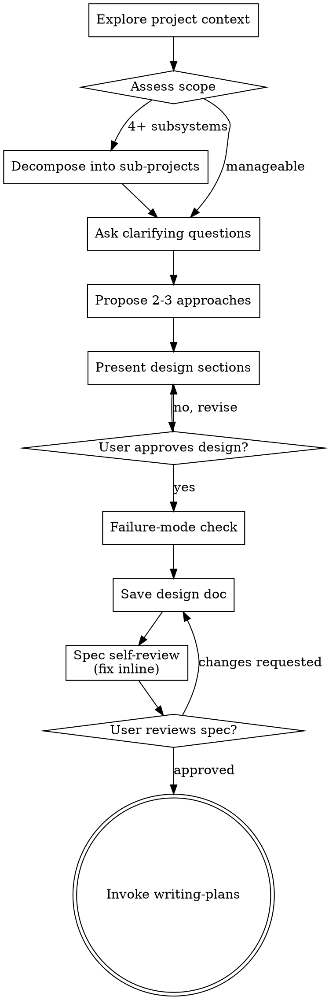

# Brainstorming

Turn rough requests into an approved design before implementation.

## Hard Gate

Do not write code, edit files, or invoke implementation skills until design approval is explicit.

## Anti-Pattern: "This Is Too Simple To Need A Design"

Every project goes through this process. A todo list, a single-function utility, a config change — all of them. "Simple" projects are where unexamined assumptions cause the most wasted work. The design can be short (a few sentences for truly simple projects), but you MUST present it and get approval.

## Checklist

1. Inspect project context (relevant files, docs, recent commits).
2. Assess scope: if the project touches 4+ independent subsystems or would require 20+ implementation tasks, decompose into sub-projects. Design each sub-project as a separate spec. Present the decomposition to the user for approval before designing individual specs.
3. Ask all clarifying questions together in a single turn. Use multiple-choice format where possible to reduce round trips.
4. Propose 2-3 approaches with trade-offs and a recommendation.
5. Present design in short sections; confirm each section.
6. For existing codebases: study existing patterns before proposing new ones. Match the project's conventions unless there's a compelling reason to diverge. Design for isolation — prefer changes that minimize blast radius and don't require coordinating across many files.
7. If the repo lacks `CLAUDE.md` / `AGENTS.md` and long-term collaboration is expected, consider using `claude-md-creator` to create a minimal, high-signal context file.
8. **Before approving the design — failure-mode check:** State the top 2-3 ways the chosen approach could fail or not cover all cases. This is adversarial reasoning, not a list of known assumptions — actively try to break the design. For each failure mode found, assess severity:
   - **Critical** (design fails for a significant user scenario): revise the design before proceeding.
   - **Minor** (edge case, acceptable limitation): document as a non-goal in the design.
   Do not skip this step. An approach that survives adversarial questioning is an approach worth approving.
9. Save approved design to `docs/specs/YYYY-MM-DD-<topic>-design.md`.
10. **Spec self-review** — quick inline check for placeholders, contradictions, ambiguity, scope (see Spec Self-Review below). Fix issues inline; no subagent dispatch needed.
11. **User reviews written spec** — ask user to review the spec file before proceeding (see User Review Gate below).
12. Invoke `writing-plans`.

## Process Flow

**The terminal state is invoking writing-plans.** Do NOT invoke frontend-design, or any other implementation skill. The ONLY skill you invoke after brainstorming is writing-plans.

## Spec Self-Review

After writing the spec document, look at it with fresh eyes:

1. **Placeholder scan:** Any "TBD", "TODO", incomplete sections, or vague requirements? Fix them.
2. **Internal consistency:** Do any sections contradict each other? Does the architecture match the feature descriptions?
3. **Scope check:** Is this focused enough for a single implementation plan, or does it need decomposition?
4. **Ambiguity check:** Could any requirement be interpreted two different ways? If so, pick one and make it explicit.

Fix any issues inline. No need to re-review — just fix and move on.

## User Review Gate

After the spec self-review passes, ask the user to review the written spec before proceeding:

> "Spec written and committed to `<path>`. Please review it and let me know if you want to make any changes before we start writing out the implementation plan."

Wait for the user's response. If they request changes, make them and re-run the self-review. Only proceed once the user approves.

## Design for Isolation and Clarity

- Break the system into smaller units that each have one clear purpose, communicate through well-defined interfaces, and can be understood and tested independently.
- For each unit, you should be able to answer: what does it do, how do you use it, and what does it depend on?
- Smaller, well-bounded units are easier to reason about — you reason better about code you can hold in context at once, and your edits are more reliable when files are focused.

## Design Contents

Include:
- Scope and non-goals
- Architecture and data flow
- Interfaces/contracts
- Error handling
- Testing strategy
- Rollout or migration notes (if needed)

## Engineering Rigor

Apply senior engineering judgment during design:
- Verify requirements are complete and unambiguous before designing.
- Identify edge cases, error paths, and cross-platform concerns early.
- Evaluate trade-offs explicitly (performance vs. readability, flexibility vs. simplicity).
- Prioritize modularity, SOLID principles, and production-ready standards.
- Flag architectural risks that will be expensive to fix later.

## Interaction Rules

- Batch all questions into a single turn; use multiple choice to reduce ambiguity.
- Remove non-essential scope (YAGNI).
- If user feedback conflicts with prior assumptions, revise design before proceeding.

## Exit Criteria

- User approved the design.
- Failure-mode check completed — critical failure modes resolved, minor ones documented as non-goals.
- Design document exists at the required path (`docs/specs/`).
- Spec self-review completed — placeholders, contradictions, ambiguity, and scope issues resolved.
- User reviewed the written spec and approved.
- `writing-plans` is invoked as the next skill.
