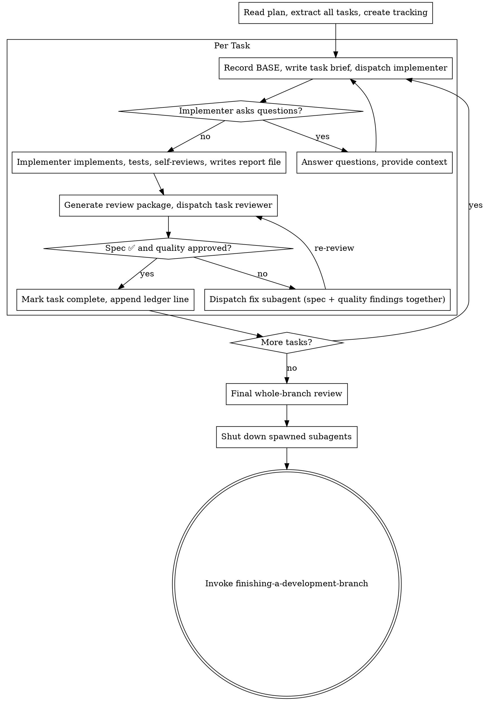

# Subagent-Driven Development

Execute a plan with fresh subagents per task and strict review gates.

## Required Start

Announce: `I'm using subagent-driven-development to execute this plan.`

## Core Flow



1. Read the plan once and extract all tasks. Run `scripts/sdd-workspace` (from this skill's directory) once to create the artifact workspace, and check `.superpowers/sdd/progress.md` for a ledger from an earlier session — tasks it marks complete are DONE; never re-dispatch them.
2. Create task tracking for all tasks. Run the Pre-Flight Plan Review (below) before dispatching Task 1.
3. For each task:
- Record BASE: `git rev-parse HEAD` before dispatching.
- Run `scripts/task-brief PLAN_FILE N` and dispatch the implementer with the brief path, a report-file path (`task-N-report.md` beside the brief), and an explicit model.
- Resolve implementer questions before coding.
- Require the implementer's ≤15-line status return; the detail lives in its report file.
- Run `scripts/review-package BASE HEAD` (never `HEAD~1` — it silently drops all but the last commit of a multi-commit task) and dispatch the single task reviewer (`./task-reviewer-prompt.md`) with the brief, report, and package paths.
- Resolve any ⚠️ "cannot verify from diff" items yourself (see Handling Reviewer ⚠️ Items).
- If the review finds Critical/Important issues: dispatch ONE fix subagent for all of them (spec gaps and quality findings together), have it append to the report file, then re-review — the re-review covers both verdicts.
- Mark task complete: update the task's checkbox in plan.md from `- [ ]` to `- [x]`, append the ledger line (see Durable Progress), and sync `state.md` if it has a plan status section.
   - For complex or high-risk tasks, validate the approach against requirements and consider simpler alternatives before or after the implementer's work.
   - For tasks centered on frontend/UI, apply `frontend-design` standards to guide structure, styling, and accessibility.
4. Run final whole-branch review.
5. Shut down all spawned subagents. Named teammates stay resident and idle
   after their task so they remain addressable for review fix cycles — they do
   not terminate themselves. Once the final review passes, send each one a
   `shutdown_request`; do not leave the user to discover a pile of idle agents.
6. Invoke `finishing-a-development-branch`.

## Pre-Flight Plan Review

Before dispatching Task 1, scan the plan once for conflicts:

- tasks that contradict each other or the plan's Global Constraints
- anything the plan explicitly mandates that the review rubric treats as a
  defect (a test that asserts nothing, verbatim duplication of a logic block)

Present everything you find to the user as one batched question — each
finding beside the plan text that mandates it, asking which governs —
before execution begins, not one interrupt per discovery mid-plan. If the
scan is clean, proceed without comment. The review loop remains the net for
conflicts that only emerge from implementation. (In Batched Autonomous Mode
a pre-flight conflict is a blocker — journal it and end the batch.)

## Parallel Waves (default for independent tasks)

When tasks are independent and touch disjoint files, dispatch them as a wave — this is the preferred mode, not a special case. Sequential execution is the fallback for dependent tasks, not the default.

**Decision rule:** Before starting execution, group tasks into waves based on file overlap and state dependencies. Tasks with no shared files and no sequential dependency belong in the same wave.

1. Build a wave of independent tasks.
2. Dispatch all implementers in a **single message** with multiple parallel Agent tool calls. Do not stagger across multiple messages.
3. Review each task with the single task-review gate. Build each task's package with `scripts/review-package --commits <that task's reported commit SHAs>` — NEVER a BASE..HEAD range in a wave: commits interleave, so a range would mix sibling tasks' changes into the review. If an implementer's report omits its commit SHAs, ask that implementer for them before reviewing.
4. Run integration verification after the wave completes.
5. Update all completed task checkboxes in plan.md (`- [ ]` → `- [x]`) and sync state.md if present.
6. Proceed to the next wave.

If any overlap or shared-state risk exists within a wave, move the conflicting task to the next sequential wave.

**Why single-message dispatch matters for cost:** All subagents share the same cached system prompt prefix. Dispatching them simultaneously in one message means every agent gets a cache hit on that prefix and only pays for its small unique task prompt. Staggered dispatch provides no additional benefit and wastes wall-clock time.

## E2E Process Hygiene

When dispatching subagents that start background services (servers, databases, queues):

Subagents are stateless — they do not know about processes started by previous subagents. Accumulated background processes cause port conflicts, stale responses, and false test results.

Include in the subagent prompt for any E2E or service-dependent task:

**Unix/macOS:**
```
Before starting any service:
1. Kill existing instances: pkill -f "<service-pattern>" 2>/dev/null || true
2. Verify the port is free: lsof -i :<port> && echo "ERROR: port still in use" || echo "Port free"

After tests complete:
1. Kill the service you started.
2. Verify cleanup: pgrep -f "<service-pattern>" && echo "WARNING: still running" || echo "Cleanup verified"
```

**Windows:**
```
Before starting any service:
1. Kill existing instances: taskkill /F /IM "<process-name>" 2>nul || echo "No existing process"
2. Verify the port is free: netstat -ano | findstr :<port> && echo "ERROR: port still in use" || echo "Port free"

After tests complete:
1. Kill the service you started.
2. Verify cleanup: tasklist | findstr "<process-name>" && echo "WARNING: still running" || echo "Cleanup verified"
```

Exception: persistent dev servers the user explicitly keeps running — document them in `state.md`.

## Batched Autonomous Mode

Use this mode when the user asks to execute a plan in batches ("implement the
next N tasks", "execute the plan in batches") or to resume a batched run
("resume the plan"). Inside a batch, execution is fully autonomous — never ask
the user. Announce: `I'm using subagent-driven-development (batched autonomous mode).`

### Batch Loop

1. If `state.md` at the project root records a plan in progress, run the
   Resume Procedure below before executing anything.
2. Execute tasks with the normal per-task flow (implementer → task review (both verdicts) → update plan.md checkbox → commit). Per-task checkboxes and
   commits are the crash-safe position record — never defer them to batch end.
   This mode executes tasks sequentially — the Parallel Waves default does NOT
   apply inside a batch, because the boundary must be evaluated after every task.
3. After each task, end the batch when ANY of the following holds:
   - **Context pressure ≥ 60% (primary boundary).** Run
     `node "<plugin-root>/hooks/skill-activator.js" --pressure "$(pwd)"`
     and stop when the JSON output has `"overThreshold": true`.
     `<plugin-root>` is this skill's plugin installation root — derive it from
     the skill's base directory (two levels up from this SKILL.md's folder), or
     use `$CLAUDE_PLUGIN_ROOT` when that variable is set.
     **Fallback:** if the command errors or prints `{"error":"unmeasurable"}`,
     cap this batch at 3 tasks total. Never let a failed measurement extend a batch.
   - **The user's explicit task count X is reached.** X is a cap, not a target —
     pressure can end the batch earlier.
   - **The plan is complete.**
   - **A blocker occurred** (see Autonomy Policy below).

### Batch End — Handoff

Write the handoff into `state.md` at the project root (full rewrite of the
plan-execution sections, hard cap 100 lines):

- `## Current Goal` — one line
- `## Plan` — path to the plan file + "Next task: N — <title>"
- `## Batch Summary` — one line per task completed THIS batch
- `## Decisions & Deviations` — choices made autonomously, with a one-line why
- `## Discovered Constraints` — forward-relevant facts (paths, gotchas, versions)
- `## Open Issues` — blockers and questions for the user; mark blocking ones
- `## Resume Instructions` — the exact prompt to paste after /clear

Do NOT re-summarize earlier batches: completed work lives in plan.md checkboxes
and git history. Carry forward only facts a future batch needs.

Before stopping, shut down all subagents spawned this batch (send each a
`shutdown_request`) — idle teammates do not survive `/clear` usefully and
would otherwise linger as orphans.

Then stop with a message stating what was completed, any open issues
(blocking questions first), and verbatim resume instructions:

> Batch complete (N tasks). Context at P%. To continue: run `/clear`, then paste:
> "Resume the plan at <plan-path> (batched autonomous mode)"

If the batch ended because the plan is complete, skip the resume instructions:
write the handoff with `## Open Issues` only (for any carry-over), then proceed
to the final whole-branch review and `finishing-a-development-branch` as in the
Core Flow.

### Autonomy Policy (inside a batch)

Never ask the user mid-batch. This overrides the interactive handling of
implementer statuses for the duration of a batch:

- **NEEDS_CONTEXT:** answer from the plan, the spec, and the repository. If the
  answer cannot be derived, treat as BLOCKED.
- **BLOCKED, plan ambiguity, or verification failing 2+ times:** end the batch
  early. Journal the blocker and the specific question under `## Open Issues`
  (marked blocking). Never best-guess a plan ambiguity — a wrong guess poisons
  every downstream task with nobody watching. Inside a batch this supersedes
  the ENTIRE escalation list under Handling Implementer Status: the autonomous
  remedies (provide more context, stronger model, split the task) may still be
  attempted first, but escalating to the user (item 4) and skip-and-advance
  (item 5) are replaced by end-batch-and-journal.

Review gates are NOT relaxed: the full task review (spec-compliance AND code-quality verdicts) per task, and pre-implementation security review for `security`-flagged tasks. A conflict found by the Pre-Flight Plan Review is a blocker: journal it under `## Open Issues` and end the batch — never best-guess a plan conflict.

### Resume Procedure (fresh session after /clear)

1. Read `state.md`; read the plan at the recorded path; read recent `git log`.
2. Reconcile position: plan.md checkboxes + git are authoritative; state.md is
   narrative and may be one batch stale. Before dispatching the first unchecked
   task, check `git log` for evidence it was already implemented (a crash
   between commit and checkbox update leaves it done but unchecked); if so,
   mark its checkbox complete and advance.
3. If `## Open Issues` contains a blocking question and the resume prompt does
   not answer it, present the question to the user and STOP — never execute
   past an unanswered blocker. Record the eventual answer under
   `## Decisions & Deviations`.
4. Start the next batch at the first genuinely unchecked task.

## Handling Implementer Status

Implementer subagents report one of four statuses. Handle each appropriately:

**DONE:** Generate the review package (`scripts/review-package BASE HEAD`, from this skill's directory — it prints the unique file path it wrote; BASE is the commit you recorded before dispatching the implementer — never `HEAD~1`), then dispatch the task reviewer with the printed path. In a wave, use `--commits` with the implementer's reported SHAs instead.

**DONE_WITH_CONCERNS:** The implementer completed the work but flagged doubts. Read the concerns before proceeding. If the concerns are about correctness or scope, address them before review. If they're observations (e.g., "this file is getting large"), note them and proceed to review.

**NEEDS_CONTEXT:** The implementer needs information that wasn't provided. Provide the missing context and re-dispatch.

**BLOCKED:** The implementer cannot complete the task. Assess the blocker:
1. If it's a context problem, provide more context and re-dispatch with the same model.
2. If the task requires more reasoning, re-dispatch with a more capable model.
3. If the task is too large, break it into smaller pieces.
4. If the plan itself is wrong, escalate to the user.
5. If the user is unavailable and the task is non-critical: document the block in `state.md` and advance to the next independent task.

**Never** ignore an escalation or force the same model to retry without changes. If the implementer said it's stuck, something needs to change. Never silently skip or mark a blocked task complete.

## File Handoffs

Everything you paste into a dispatch prompt — and everything a subagent
prints back — stays resident in your context for the rest of the session
and is re-read on every later turn. Hand artifacts over as files in the
workspace (`scripts/sdd-workspace` prints its path):

- **Task brief:** before dispatching an implementer, run this skill's
  `scripts/task-brief PLAN_FILE N` — it extracts the task's full text to a
  uniquely named file and prints the path. Compose the dispatch so the
  brief stays the single source of requirements. Your dispatch should
  contain: (1) one line on where this task fits in the project; (2) the
  brief path, introduced as "read this first — it is your requirements,
  with the exact values to use verbatim"; (3) interfaces and decisions
  from earlier tasks that the brief cannot know; (4) your resolution of
  any ambiguity you noticed in the brief; (5) the report-file path and
  report contract. Exact values (numbers, magic strings, signatures, test
  cases) appear only in the brief.
- **Report file:** name the implementer's report file after the brief
  (brief `…/task-N-brief.md` → report `…/task-N-report.md`) and put it in
  the dispatch prompt. The implementer writes the full report there and
  returns only status, commits, a one-line test summary, and concerns.
- **Reviewer inputs:** the task reviewer gets three paths — the same brief
  file, the report file, and the review package — plus the global
  constraints that bind the task, copied verbatim from the plan.
- Fix dispatches append their fix report (with test results) to the same
  report file and return a short summary; re-reviews read the updated file.
- A dispatch prompt describes one task, not the session's history. Do not
  paste accumulated prior-task summaries into later dispatches — a fresh
  subagent needs its task, the interfaces it touches, and the global
  constraints. Nothing else.

## Handling Reviewer ⚠️ Items

The task reviewer may report "⚠️ Cannot verify from diff" items —
requirements that live in unchanged code or span tasks. These do not block
the rest of the review, but you must resolve each one yourself before
marking the task complete: you hold the plan and cross-task context the
reviewer lacks. If you confirm an item is a real gap, treat it as a failed
spec verdict — send it back to the implementer and re-review.

## Constructing Reviewer Prompts

Per-task reviews are task-scoped gates. The broad review happens once, at
the final whole-branch review. When you fill a reviewer template:

- Do not add open-ended directives like "check all uses" or "run race
  tests if useful" without a concrete, task-specific reason.
- Do not ask a reviewer to re-run tests the implementer already ran on the
  same code — the implementer's report carries the test evidence.
- Do not pre-judge findings for the reviewer — never instruct a reviewer
  to ignore or not flag a specific issue. If the prompt you are writing
  contains "do not flag," "don't treat X as a defect," "at most Minor," or
  "the plan chose" — stop: you are pre-judging, usually to spare yourself
  a review loop.
- Dispatch ONE fix subagent for all of a review's Critical and Important
  findings. Record Minor findings in the progress ledger as you go, and
  point the final whole-branch review at that list so it can triage which
  must be fixed before merge. A roll-up nobody reads is a silent discard.
- A finding labeled plan-mandated — or any finding that conflicts with
  what the plan's text requires — is the user's decision, like any plan
  contradiction: present the finding and the plan text, ask which governs.
  (In Batched Autonomous Mode: journal it and end the batch.)
- The final whole-branch review gets a package too: run
  `scripts/review-package MERGE_BASE HEAD` (MERGE_BASE = the commit the
  branch started from, e.g. `git merge-base main HEAD`) and include the
  printed path in the final review dispatch.
- If the final whole-branch review returns findings, dispatch ONE fix
  subagent with the complete findings list — not one fixer per finding.
  Per-finding fixers each rebuild context and re-run suites.
- Every fix dispatch carries the implementer contract: the fix subagent
  re-runs the tests covering its change, appends results to the report
  file, and the re-review is dispatched only once the report shows the
  covering tests, the command run, and the output.

## Durable Progress

Conversation memory does not survive compaction. A controller that loses
its place re-dispatches entire completed task sequences — the single most
expensive failure mode. Track progress in a ledger file, not only in todos:

- At skill start, check for a ledger: `.superpowers/sdd/progress.md`.
  Tasks listed there as complete are DONE — do not re-dispatch them.
- When a task's review comes back clean, append one line:
  `Task N: complete (commits <base7>..<head7>, review clean)` — plus
  `Minor: <finding>` lines for any Minor findings being carried forward.
- plan.md checkboxes + git log remain authoritative for position (as the
  Batched Autonomous Mode resume procedure defines); the ledger adds the
  commit ranges for post-compaction recovery and the Minor-finding list
  for final-review triage. After compaction, trust the ledger and
  `git log` over your own recollection.
- `git clean -fdx` destroys the ledger (it is git-ignored scratch); if
  that happens, recover from `git log`.

## Hard Rules

- Do not execute implementation on `main`/`master` without explicit user permission.
- Do not skip the task review — both verdicts, spec compliance and code quality.
- Do not accept unresolved review findings.
- Do not paste task text, diffs, or reports into dispatch prompts when a workspace file can carry them — pass paths (see File Handoffs).
- Never coach a reviewer: no "do not flag X", no pre-rated severities, no suppressed findings.
- Narration: between tool calls, narrate at most one short line — the ledger and the tool results carry the record.

## Context Isolation

Never forward parent session context or history to subagents. Construct each subagent's prompt from scratch using only:
- Task text
- Acceptance criteria
- Needed file paths
- Relevant constraints

Exclude unrelated prior assistant analysis and old failed hypotheses. Subagents must not receive conversation history, prior reasoning chains, or context from other subagent runs.

**Why this is also the cache-optimal approach:** All subagents share the same system prompt prefix, which the API caches. Keeping each subagent's input as `[cached system prompt] + [small unique task prompt]` means every agent hits the cache for the heavy shared prefix and only pays full input token price for its small task-specific tail. Forwarding parent conversation history would make each subagent's prefix unique, breaking cache sharing and multiplying input costs across the wave.

## Subagent Skill Leakage Prevention

Subagents can discover superpowers-optimized skills via filesystem access and invoke them, causing a focused implementer to behave as a workflow orchestrator. Every subagent prompt MUST include this instruction:

> You are a focused subagent. Do NOT invoke any skills from the superpowers-optimized plugin. Do NOT use the Skill tool. Your only job is the task described below.

## Model Selection for Agent Tool Calls

Choose model based on task type when dispatching subagents via the Agent tool:

| Model | Use for |
|---|---|
| `haiku` | File reads, summarization, log scanning, patch verification — output is data, not decisions |
| `sonnet` | Default for all implementation tasks |
| `opus` | Architecture analysis, complex design review, multi-system debugging, any task requiring reasoning across many constraints at once |

Apply via the `model` parameter in Agent tool calls. Default to `sonnet` when uncertain. Only upgrade to `opus` when the task is genuinely reasoning-heavy — not just large.

**Always specify the model explicitly when dispatching a subagent.** An
omitted model inherits your session's model — often the most capable and
most expensive — which silently defeats this section. Every prompt
template marks `model:` as REQUIRED.

**Turn count beats token price.** Wall-clock and context cost scale with
how many turns a subagent takes, and the cheapest models routinely take
2-3× the turns on multi-step work — costing more overall. Use `sonnet` as
the floor for reviewers and for implementers working from prose
descriptions. Use `haiku` for an implementer only when the plan text
contains the complete code to write (transcription plus testing) or for a
single-file mechanical fix. Scale reviewer models to the diff's size,
complexity, and risk — a subtle concurrency change deserves `opus`; the
final whole-branch review always runs on `opus`, not the session default.

## Prompt Templates

Use:
- `./implementer-prompt.md`
- `./task-reviewer-prompt.md`

## Integration

- Setup workspace first with `using-git-worktrees`.
- The final whole-branch review uses `requesting-code-review/code-reviewer.md` on the most capable model.
- Finish with `finishing-a-development-branch`.
