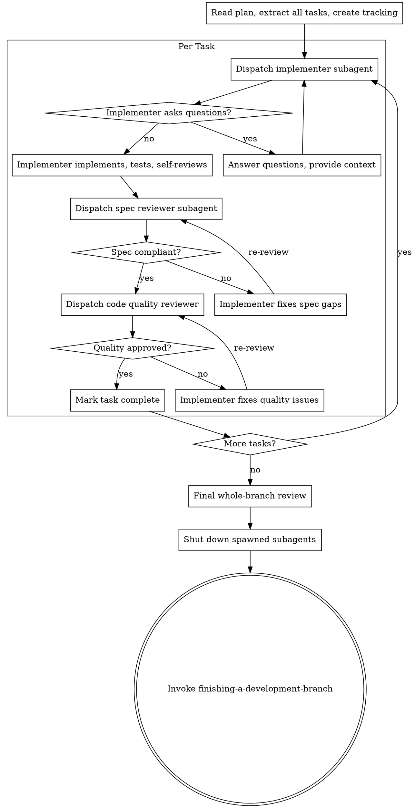

# Subagent-Driven Development

Execute a plan with fresh subagents per task and strict review gates.

## Required Start

Announce: `I'm using subagent-driven-development to execute this plan.`

## Core Flow



1. Read the plan once and extract all tasks.
2. Create task tracking for all tasks.
3. For each task:
- Dispatch implementer subagent with full task text and minimal required context.
- Resolve implementer questions before coding.
- Require implementer verification evidence.
- Run spec-compliance review.
- If spec fails, return to implementer and re-review.
- Run code-quality review.
- If quality fails, return to implementer and re-review.
- Mark task complete: update the task’s checkbox in plan.md from `- [ ]` to `- [x]`. If `state.md` exists with a plan status section, update it to reflect the completed task.
   - For complex or high-risk tasks, validate the approach against requirements and consider simpler alternatives before or after the implementer’s work.
   - For tasks centered on frontend/UI, apply `frontend-design` standards to guide structure, styling, and accessibility.
4. Run final whole-branch review.
5. Shut down all spawned subagents. Named teammates stay resident and idle
   after their task so they remain addressable for review fix cycles — they do
   not terminate themselves. Once the final review passes, send each one a
   `shutdown_request`; do not leave the user to discover a pile of idle agents.
6. Invoke `finishing-a-development-branch`.

## Parallel Waves (default for independent tasks)

When tasks are independent and touch disjoint files, dispatch them as a wave — this is the preferred mode, not a special case. Sequential execution is the fallback for dependent tasks, not the default.

**Decision rule:** Before starting execution, group tasks into waves based on file overlap and state dependencies. Tasks with no shared files and no sequential dependency belong in the same wave.

1. Build a wave of independent tasks.
2. Dispatch all implementers in a **single message** with multiple parallel Agent tool calls. Do not stagger across multiple messages.
3. Review each task with the same two-stage gate.
4. Run integration verification after the wave completes.
5. Update all completed task checkboxes in plan.md (`- [ ]` → `- [x]`) and sync state.md if present.
6. Proceed to the next wave.

If any overlap or shared-state risk exists within a wave, move the conflicting task to the next sequential wave.

**Why single-message dispatch matters for cost:** All subagents share the same cached system prompt prefix. Dispatching them simultaneously in one message means every agent gets a cache hit on that prefix and only pays for its small unique task prompt. Staggered dispatch provides no additional benefit and wastes wall-clock time.

## E2E Process Hygiene

When dispatching subagents that start background services (servers, databases, queues):

Subagents are stateless — they do not know about processes started by previous subagents. Accumulated background processes cause port conflicts, stale responses, and false test results.

Include in the subagent prompt for any E2E or service-dependent task:

**Unix/macOS:**
```
Before starting any service:
1. Kill existing instances: pkill -f "<service-pattern>" 2>/dev/null || true
2. Verify the port is free: lsof -i :<port> && echo "ERROR: port still in use" || echo "Port free"

After tests complete:
1. Kill the service you started.
2. Verify cleanup: pgrep -f "<service-pattern>" && echo "WARNING: still running" || echo "Cleanup verified"
```

**Windows:**
```
Before starting any service:
1. Kill existing instances: taskkill /F /IM "<process-name>" 2>nul || echo "No existing process"
2. Verify the port is free: netstat -ano | findstr :<port> && echo "ERROR: port still in use" || echo "Port free"

After tests complete:
1. Kill the service you started.
2. Verify cleanup: tasklist | findstr "<process-name>" && echo "WARNING: still running" || echo "Cleanup verified"
```

Exception: persistent dev servers the user explicitly keeps running — document them in `state.md`.

## Batched Autonomous Mode

Use this mode when the user asks to execute a plan in batches ("implement the
next N tasks", "execute the plan in batches") or to resume a batched run
("resume the plan"). Inside a batch, execution is fully autonomous — never ask
the user. Announce: `I'm using subagent-driven-development (batched autonomous mode).`

### Batch Loop

1. If `state.md` at the project root records a plan in progress, run the
   Resume Procedure below before executing anything.
2. Execute tasks with the normal per-task flow (implementer → spec review →
   quality review → update plan.md checkbox → commit). Per-task checkboxes and
   commits are the crash-safe position record — never defer them to batch end.
   This mode executes tasks sequentially — the Parallel Waves default does NOT
   apply inside a batch, because the boundary must be evaluated after every task.
3. After each task, end the batch when ANY of the following holds:
   - **Context pressure ≥ 60% (primary boundary).** Run
     `node "<plugin-root>/hooks/skill-activator.js" --pressure "$(pwd)"`
     and stop when the JSON output has `"overThreshold": true`.
     `<plugin-root>` is this skill's plugin installation root — derive it from
     the skill's base directory (two levels up from this SKILL.md's folder), or
     use `$CLAUDE_PLUGIN_ROOT` when that variable is set.
     **Fallback:** if the command errors or prints `{"error":"unmeasurable"}`,
     cap this batch at 3 tasks total. Never let a failed measurement extend a batch.
   - **The user's explicit task count X is reached.** X is a cap, not a target —
     pressure can end the batch earlier.
   - **The plan is complete.**
   - **A blocker occurred** (see Autonomy Policy below).

### Batch End — Handoff

Write the handoff into `state.md` at the project root (full rewrite of the
plan-execution sections, hard cap 100 lines):

- `## Current Goal` — one line
- `## Plan` — path to the plan file + "Next task: N — <title>"
- `## Batch Summary` — one line per task completed THIS batch
- `## Decisions & Deviations` — choices made autonomously, with a one-line why
- `## Discovered Constraints` — forward-relevant facts (paths, gotchas, versions)
- `## Open Issues` — blockers and questions for the user; mark blocking ones
- `## Resume Instructions` — the exact prompt to paste after /clear

Do NOT re-summarize earlier batches: completed work lives in plan.md checkboxes
and git history. Carry forward only facts a future batch needs.

Before stopping, shut down all subagents spawned this batch (send each a
`shutdown_request`) — idle teammates do not survive `/clear` usefully and
would otherwise linger as orphans.

Then stop with a message stating what was completed, any open issues
(blocking questions first), and verbatim resume instructions:

> Batch complete (N tasks). Context at P%. To continue: run `/clear`, then paste:
> "Resume the plan at <plan-path> (batched autonomous mode)"

If the batch ended because the plan is complete, skip the resume instructions:
write the handoff with `## Open Issues` only (for any carry-over), then proceed
to the final whole-branch review and `finishing-a-development-branch` as in the
Core Flow.

### Autonomy Policy (inside a batch)

Never ask the user mid-batch. This overrides the interactive handling of
implementer statuses for the duration of a batch:

- **NEEDS_CONTEXT:** answer from the plan, the spec, and the repository. If the
  answer cannot be derived, treat as BLOCKED.
- **BLOCKED, plan ambiguity, or verification failing 2+ times:** end the batch
  early. Journal the blocker and the specific question under `## Open Issues`
  (marked blocking). Never best-guess a plan ambiguity — a wrong guess poisons
  every downstream task with nobody watching. Inside a batch this supersedes
  the ENTIRE escalation list under Handling Implementer Status: the autonomous
  remedies (provide more context, stronger model, split the task) may still be
  attempted first, but escalating to the user (item 4) and skip-and-advance
  (item 5) are replaced by end-batch-and-journal.

Review gates are NOT relaxed: full spec-compliance and code-quality review per
task, and pre-implementation security review for `security`-flagged tasks.

### Resume Procedure (fresh session after /clear)

1. Read `state.md`; read the plan at the recorded path; read recent `git log`.
2. Reconcile position: plan.md checkboxes + git are authoritative; state.md is
   narrative and may be one batch stale. Before dispatching the first unchecked
   task, check `git log` for evidence it was already implemented (a crash
   between commit and checkbox update leaves it done but unchecked); if so,
   mark its checkbox complete and advance.
3. If `## Open Issues` contains a blocking question and the resume prompt does
   not answer it, present the question to the user and STOP — never execute
   past an unanswered blocker. Record the eventual answer under
   `## Decisions & Deviations`.
4. Start the next batch at the first genuinely unchecked task.

## Handling Implementer Status

Implementer subagents report one of four statuses. Handle each appropriately:

**DONE:** Proceed to spec compliance review.

**DONE_WITH_CONCERNS:** The implementer completed the work but flagged doubts. Read the concerns before proceeding. If the concerns are about correctness or scope, address them before review. If they're observations (e.g., "this file is getting large"), note them and proceed to review.

**NEEDS_CONTEXT:** The implementer needs information that wasn't provided. Provide the missing context and re-dispatch.

**BLOCKED:** The implementer cannot complete the task. Assess the blocker:
1. If it's a context problem, provide more context and re-dispatch with the same model.
2. If the task requires more reasoning, re-dispatch with a more capable model.
3. If the task is too large, break it into smaller pieces.
4. If the plan itself is wrong, escalate to the user.
5. If the user is unavailable and the task is non-critical: document the block in `state.md` and advance to the next independent task.

**Never** ignore an escalation or force the same model to retry without changes. If the implementer said it's stuck, something needs to change. Never silently skip or mark a blocked task complete.

## Hard Rules

- Do not execute implementation on `main`/`master` without explicit user permission.
- Do not skip spec review.
- Do not skip quality review.
- Do not accept unresolved review findings.
- Do not ask subagents to read long plan files when task text can be passed directly.

## Context Isolation

Never forward parent session context or history to subagents. Construct each subagent's prompt from scratch using only:
- Task text
- Acceptance criteria
- Needed file paths
- Relevant constraints

Exclude unrelated prior assistant analysis and old failed hypotheses. Subagents must not receive conversation history, prior reasoning chains, or context from other subagent runs.

**Why this is also the cache-optimal approach:** All subagents share the same system prompt prefix, which the API caches. Keeping each subagent's input as `[cached system prompt] + [small unique task prompt]` means every agent hits the cache for the heavy shared prefix and only pays full input token price for its small task-specific tail. Forwarding parent conversation history would make each subagent's prefix unique, breaking cache sharing and multiplying input costs across the wave.

## Subagent Skill Leakage Prevention

Subagents can discover superpowers-optimized skills via filesystem access and invoke them, causing a focused implementer to behave as a workflow orchestrator. Every subagent prompt MUST include this instruction:

> You are a focused subagent. Do NOT invoke any skills from the superpowers-optimized plugin. Do NOT use the Skill tool. Your only job is the task described below.

## Model Selection for Agent Tool Calls

Choose model based on task type when dispatching subagents via the Agent tool:

| Model | Use for |
|---|---|
| `haiku` | File reads, summarization, log scanning, patch verification — output is data, not decisions |
| `sonnet` | Default for all implementation tasks |
| `opus` | Architecture analysis, complex spec review, multi-system debugging, any task requiring reasoning across many constraints at once |

Apply via the `model` parameter in Agent tool calls. Default to `sonnet` when uncertain. Only upgrade to `opus` when the task is genuinely reasoning-heavy — not just large.

## Prompt Templates

Use:
- `./implementer-prompt.md`
- `./spec-reviewer-prompt.md`
- `./code-quality-reviewer-prompt.md`

## Integration

- Setup workspace first with `using-git-worktrees`.
- Use `requesting-code-review` templates for quality review structure.
- Finish with `finishing-a-development-branch`.
